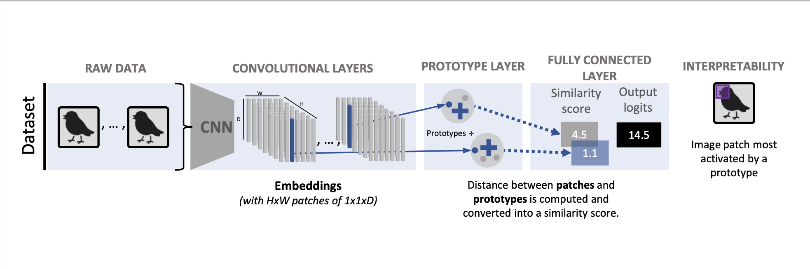
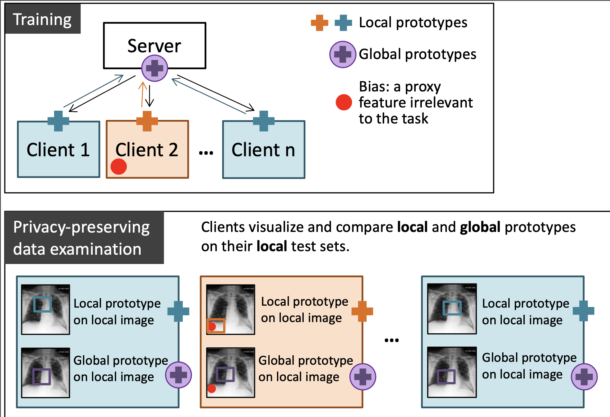

## MyThisYourThat (MyTH): Interpretable bias identification in federated learning for images

Data compatibility between the clients in federated learning (FL) is of utmost importance for training an efficient and generalizable model. We present `MyTH` ([Naumova et al.](https://github.com/EPFLiGHT/MyTH)), a visually interpretable and privacy-preserving approach for bias identification in FL that leverages a prototypical part learning network `ProtoPNet` ([Chen et al.](https://arxiv.org/abs/1806.10574)).

`ProtoPNet` is an inherently interpretable deep learning network which learns prototypical parts in training images for each class. The prediction is based on the similarity score between the prototypes and the latent representation of an image. 

The network consists of three parts (see scheme below): 
- a set of convolutional layers to learn features from the input images;
- a prototype layer which learns prototypes;
- a fully-connected layer which outputs the class logits.

The prototype layer computes squared L2-distance between each prototype and each patch of the output of the convolutional layers, i.e. image embedding. Then these distances are converted into similarity scores and fed into the final fully-connected layer. The prototypes are _parameters_ of the network and are updated after backpropagating gradients of the loss function as usual.

Learned prototypes can be visualized on an image as mostly activated regions with the help of a `push` function. The most activated region corresponds to a latent patch closest to a prototype.

Now, let's have a look at how `MyTH` usses `ProtoPNet` to allow the identification of incopatible data in federated setting.

1. Each client trains a local ProtoPNet on its own data set.
2. With the help of a central server, the clients train a global model sharing all learnable parameters of the network including prototypes.
3. Each client visualizes its _local_ and _global_ prototypes (by finding the most activated patches) on its _local_ test set and compares them by means of simple visual inspection (ideally with the help of domain experts). There is no need to share a test set with other clients or the server.
4. A large difference between local and global prototypes for certain clients indicates a possible data bias in the federation and requires the clients to either quit the federation or take measures to improve the quality of their training data.